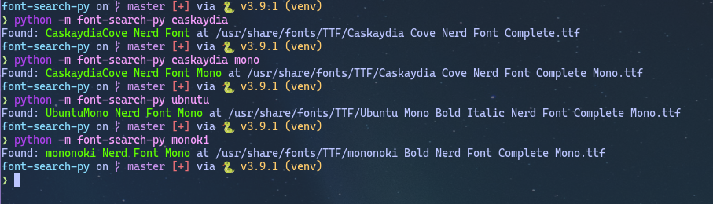

# font-search (python)

A simple script to make easier searches in fontconfig, using [python-Levenshtein](https://github.com/miohtama/python-Levenshtein) and [python-fontconfig](https://github.com/Vayn/python-fontconfig).



## The Why

Two weeks ago I wanted to try a new font in my awesome terminal, [alacritty](https://github.com/alacritty/alacritty). But I didn't get the name right for a long time and poor Alacritty couldn't recognise the font I was trying to get it to show. I've made this program so less people have to go through this hell of not knowing what is the 'official' name of the font in your system.

## How it works

As I've said earlier, I'm using levenshtein algorithm to determine how far are two strings. The core part of this algorithm is on its pre-processing of the data.

`fontconfig.query()` gives me all the font **paths**, so first I remove all of the parent directories and the extension from each path.

Then I get all of the words that make up the path. I've set word boundaries as follows:

- any whitespace defined by `string.whitespace`
- any punctuation as defined by `string.punctuation`
- change from alphabetic to non-alphabetic or viceversa
- change from alphabetic lower case to upper case

The `sort_search` function receives a list of keywords and returns a closure which will process each path and return the sum of the ratios between all the words of the font name and the search terms, giving more priority to the first terms by dividing by its order, e.g `ratio / 1`, `ratio / 2`, etc.

## Installing

I've set up a little script that generates a virtual environment and installs the dependencies.

- [Guided steps](#Guided-steps)
- [Let a robot do it for you](#Using-a-Script)

### Guided steps

If you want to do it yourself, here you go:

1. Clone this branch, if you haven't done so already:

```sh
git clone -b python --single-branch https://github.com/CyberGsus/font-search.git
```

2. Create a virtual environment and activate it:

```
python3 -m virtualenv venv
source ./venv/bin/activate # if you're using fish, just use ./venv/bin/activate.fish
```

3. You'll have to regenerate the C files for `python-fontconfig`. You need `cython`. Here are the steps:

```sh
# Get it
git clone https://github.com/Vayn/python-fontconfig
cd python-fontconfig
# Regenerate C file
rm -f fontconfig.c
cython fontconfig.pyx
# Install it !!!Please do it with your venv sourced!!!
python setup.py install
```

4. The fourth step is to install the other dependency with `pip`:

```sh
pip install -U pip python-Levenshtein
```

### Using a Script

Check `install.sh`, and when you're ready, run it:

```sh
sh install.sh
```

which does the above steps but automatically

